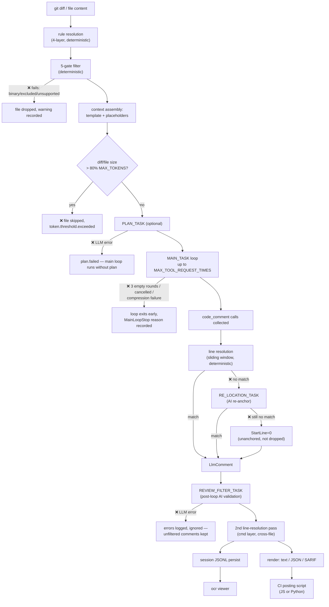
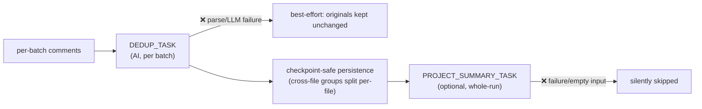

Parent document: `/CLAUDE.md`
Related documents:
- `docs/ai/AI_SYSTEM_MAP.md`
- `docs/architecture/DATA_LINEAGE.md`
- `docs/operations/FAILURE_MODES.md`

Read this when:
- You need the single end-to-end diagram of the AI pipeline with every failure point marked.

Purpose:
- One consolidated pipeline view: context assembly → model call → validation → persistence → downstream usage, with failure points annotated.

Scope:
- Included: the full review-mode pipeline (scan's divergences noted inline).
- Excluded: per-component deep-dives (already covered by `PROMPTS.md`, `LLM_ARCHITECTURE.md`, `MODEL_GUARDRAILS.md` — this doc is the map that ties them together).

---

# AI Pipeline Map

## Scan-mode divergence (inserted between M and N)

## Failure-point summary (see `docs/operations/FAILURE_MODES.md` for recovery detail)

| Stage | Failure mode | Blast radius |
|---|---|---|
| Filter | file dropped | that file only; non-fatal |
| Token check | file skipped pre-call | that file only; reported as a warning |
| Plan | LLM error | that file's plan skipped, main loop still runs |
| Main loop | 3 empty rounds / cancelled / compression failure | that file's review incomplete, partial comments kept |
| Line resolution | no match | comment kept with `StartLine=0`, never dropped |
| Review filter | LLM error | filter pass skipped, **unfiltered** comments ship — a quality regression, not a crash |
| Scan dedup | LLM/parse failure | originals kept, best-effort only |
| Scan project summary | failure/empty | silently skipped, run still succeeds |
| Persistence | crash before flush | buffered `llm_request`/`llm_response`/`tool_call` detail lost; checkpoints (`review_item_*`) survive because they force-flush |

## Known gaps / uncertainties:
- Whether `REVIEW_FILTER_TASK` failures are surfaced anywhere visible to the end user (vs. purely logged) was not confirmed.
