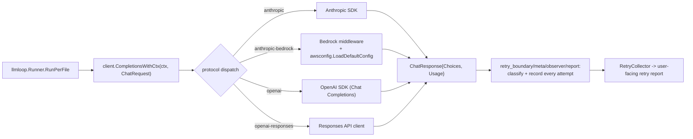

Parent document: `/CLAUDE.md`
Related documents:
- `docs/architecture/DATA_CONTRACTS.md`
- `docs/ai/AI_PIPELINE_MAP.md`
- `pages/src/content/docs/en/configuration.md` (user-facing provider setup)

Read this when:
- You're adding a provider, changing retry behavior, or debugging an LLM request failure.

Purpose:
- The provider/protocol/client/retry machinery underneath the agent loop — the layer below `pages/.../architecture.md`.

Scope:
- Included: endpoint resolution, protocol abstraction, client construction, retry/error classification, token handling.
- Excluded: prompt content (`PROMPTS.md`), the tool-use loop itself (`docs/architecture/RUNTIME_FLOWS.md`).

---

# LLM Architecture

## Endpoint resolution — exactly one endpoint per run, no cross-provider fallback

`internal/llm/resolver.go`'s `ResolveEndpointWithOptions` tries, in order, stopping at the **first complete** result (`Model != "" && (AmbientAuth || (URL != "" && Token != ""))`):

1. Explicit `--provider` override → OCR config file **only**; error if not configured there (no fallthrough).
2. OCR config file (`~/.opencodereview/config.json`) — `provider`/`providers`/`custom_providers`, or the legacy `llm{}` block.
3. OCR environment (`OCR_LLM_URL`/`TOKEN`/`MODEL`, `OCR_LLM_PROTOCOL` or `OCR_USE_ANTHROPIC`).
4. Claude Code environment (`ANTHROPIC_BASE_URL`/`AUTH_TOKEN`/`MODEL`).
5. Shell rc files (`~/.zshrc`, `.bashrc`, `.bash_profile`, `.profile`), regex-parsed `export ANTHROPIC_*` lines.

**There is no merging across sources** and **no automatic fallback to a second provider/model if the first fails at request time** — confirmed directly against `cmd/opencodereview/shared.go` (one `ResolveEndpointWithOptions` call, one `NewLLMClient` call, wired once for the whole run). If nothing resolves, the process exits non-zero before any network call. This is a deliberate design choice (`pages/.../architecture.md`: "Endpoint discovery has no fallback") — see `docs/CLAUDE.md` § Rules for Safe Changes before adding one.

Global env overrides (`OCR_LLM_TIMEOUT`, `OCR_LLM_EXTRA_HEADERS`) are parsed before any strategy runs but applied after, specifically so a malformed value fails before an `api_key_cmd` prompts a secret manager for a credential that would then be discarded.

## Protocol abstraction (`internal/llm/protocol.go`)

Four canonical protocols behind one `LLMClient` interface: `anthropic`, `openai` (Chat Completions), `openai-responses` (`/v1/responses`, for GPT-5.x/o-series), `anthropic-bedrock` (SigV4-signed, ambient AWS credential chain, no API key). `NormalizeProtocol`/`ValidateProtocol` gate every resolver and client-factory branch.

## Provider registry (`internal/llm/providers.go`)

26 built-in presets (Anthropic, Bedrock, OpenAI, and a long tail of Gemini/DashScope/Volcengine/DeepSeek/TokenHub/iFlytek/Kimi/Z.AI/MiMo/MiniMax/Qianfan/SiliconFlow/Novita/xAI/LiteLLM/Mistral) plus arbitrary custom providers (must supply `url` + `protocol`). Full table with base URLs and env vars: `pages/src/content/docs/en/configuration.md`.

## Request pipeline

## Retry & error classification — not a naive retry loop

`retry_boundary.go`/`retry_meta.go`/`retry_observer.go`/`retry_report.go` form a **classification and reporting subsystem**, not the retry mechanism itself. `RequestMeta` carries per-logical-request identity through context; failures are bucketed by `ErrorClass` (`cancelled`/`timeout`/`network`/`provider`/`unknown`) × `FailurePhase` (`context`/`response_decode`/`stream`); a `RetryCollector` records every attempt and builds a retry report surfaced to the user (this backs the "clarify LLM request failures by review stage" recent change). **Actual retry/backoff execution is delegated to the underlying Anthropic/OpenAI SDKs** — both retry 5xx/408/429 natively. OCR's own `retry_codes` config only *adds* extra 4xx codes to that SDK-native set; `sanitizeRetryCodes` rejects 5xx (redundant) and silently drops 408/409/429 if supplied (already default).

## Token handling

`tiktoken-go` for token counting; `MAX_TOKENS` (default 58,888, config-overridable) gates the fail-fast pre-call check (skip file if prompt > 80% of budget) and the compression thresholds (60% async, 80% sync — see `pages/.../architecture.md`). `usage_resolver.go` normalizes provider-differing usage-field shapes into one `UsageInfo{prompt_tokens, completion_tokens, cache_read_tokens, cache_write_tokens}`.

## Response content handling

`ChatResponse.Content()` strips `<think>` tags and falls back to `ReasoningContent` when present — a normalization layer so downstream code doesn't need per-provider reasoning-format knowledge.

## Hidden coupling / fragile assumptions

- `ensureMessagesSuffix` auto-appends `/v1/messages` to Anthropic base URLs unless a `/v1/` segment is already present anywhere in the URL — a custom gateway with an unconventional path could be silently misrouted.
- Static `api_key` silently wins over `api_key_cmd` (stderr warning only, not an error) — a stale checked-in command can go unnoticed.
- Whitespace-only `api_key`/`auth_token` is treated as unset (to allow `_cmd` fallback) — `" "` and `""` behave differently in a way that isn't visually obvious in a config file.
- `reservedHeaders` (authorization, x-api-key, content-type, user-agent) block `extra_headers` overrides — a provider requiring a non-standard content-type needs a code change, not a config change.
- Bedrock's model list is explicitly non-exhaustive/account-specific — treat it as a starting point, not a validation source.

## Known gaps / uncertainties:
- `sessionkey.go`'s exact per-session LLM-client keying/caching behavior was not fully read.
- `embedded_loader.go` contents beyond its role as the embedded-asset registration point were not fully read.
