Parent document: `/CLAUDE.md`
Related documents:
- `docs/architecture/DATA_CONTRACTS.md`
- `docs/ai/AI_PIPELINE_MAP.md`

Read this when:
- You need to trace where a piece of data (a comment, a rule, a config value) came from or where it ends up.
- You're debugging "why does this comment say X" or "why did this rule apply."

Purpose:
- Origin → transformation → storage → consumption lineage for the entities that matter most: diffs, comments, rules, provider config.

Scope:
- Included: lineage diagrams for the four highest-value entities.
- Excluded: schema field definitions (see `DATA_CONTRACTS.md`).

---

# Data Lineage

## Comment lineage (the core value the system produces)

```mermaid
flowchart LR
    A["git diff / file content"] --> B["prompt assembly<br/>(rule + diff + placeholders)"]
    B --> C["LLM main-loop<br/>code_comment tool call"]
    C --> D["CodeReviewResult<br/>(raw, pre-anchor)"]
    D --> E["sliding-window line resolution"]
    E -->|match failed| F["RE_LOCATION_TASK<br/>AI re-anchor fallback"]
    E -->|matched or gave up| G["LlmComment<br/>(StartLine may be 0)"]
    F --> G
    G --> H["REVIEW_FILTER_TASK<br/>drops provably-incorrect comments"]
    H --> I["2nd line-resolution pass<br/>(cmd layer, cross-file cases)"]
    I --> J["session JSONL<br/>(review_item_done.comments)"]
    I --> K["renderer: text / JSON / SARIF"]
    J --> L["ocr viewer"]
    K --> M["CI posting script<br/>(JS or Python, per platform)"]
```

Scan mode adds one more stage between H and I: `DEDUP_TASK` (per-batch, cross-file merge), logged under the overloaded `memory_compression_task` type (see `DATA_CONTRACTS.md`).

## Diff lineage

`git diff`/`git show`/working-tree read → `internal/diff` parses into `model.Diff` (per-mode: Workspace/Commit/Range) → `internal/agent`'s 5-gate filter decides keep/drop → surviving diffs become the `{{diff}}` placeholder in the prompt **and** the source for line-anchoring during comment resolution **and** the `file_read_diff` tool's cross-file context source. Untracked files are read from disk and treated as full-file additions so they're reviewable pre-commit.

## Rule lineage

Four layers, first match wins per file path: `--rule` flag → `<repo>/.opencodereview/rule.json` → `~/.opencodereview/rule.json` → embedded `system_rules.json` + `rule_docs/*.md` (`//go:embed`, always present). Resolved rule text becomes the `{{system_rule}}` placeholder — it flows into every prompt sent for that file, meaning a rule change directly and immediately changes model behavior for every file matching its pattern, with no intermediate validation step.

## Provider config lineage

`~/.opencodereview/config.json` (or legacy `llm{}` block) / OCR env vars / Claude Code env vars / shell rc files → `internal/llm.ResolveEndpointWithOptions` → single `ResolvedEndpoint{URL, Token, Model, Protocol, ...}` → `NewLLMClient` → every LLM call for the run. API keys never flow into: logs, telemetry, or session JSONL headers (though session JSONL **does** carry full prompt/response content — see `docs/security/SECURITY_MODEL.md`).

## Known gaps / uncertainties:
- Whether the `--max-tokens-budget` aggregate counter reads from the same token-usage source as the per-request telemetry metric, or is tracked independently, was not directly confirmed.
