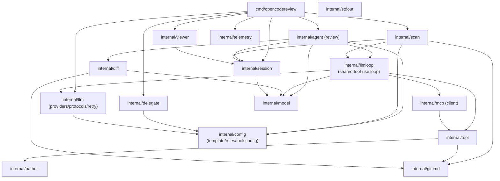

Parent document: `/CLAUDE.md`
Related documents:
- `docs/architecture/REPOSITORY_MAP.md`
- `docs/architecture/MODULE_OWNERSHIP.md`
- `docs/architecture/CHANGE_BLAST_RADIUS.md`

Read this when:
- You need to know what breaks if you change a package's public surface.
- You're deciding where new shared logic should live.

Purpose:
- Module-level Go package dependency graph and the hidden-coupling points that aren't obvious from imports alone.

Scope:
- Included: `internal/*` and `cmd/opencodereview` package relationships.
- Excluded: external Go module dependencies (see `go.mod`), non-Go integration coupling (see `docs/integrations/EXTERNAL_INTEGRATIONS.md`).

---

# Dependency Graph

## Hidden coupling worth flagging

- **`internal/llmloop` is the true hub, not `internal/agent`.** Both `review` and `scan` delegate the actual tool-use loop, token accounting, and memory compression to `llmloop.Runner`. A change here affects both commands simultaneously — `DEPENDENCY_GRAPH.md` readers should not assume `internal/agent` owns loop behavior in isolation.
- **`internal/model` is a leaf with maximum fan-in.** `Diff`, `LlmComment`, `CodeReviewResult` are read/written by `agent`, `scan`, `diff`, `llmloop`, `session`, and the CLI output layer. It has no internal dependencies itself, which makes it easy to change carelessly — every consumer breaks silently at compile time only if the field is removed, not if its *meaning* changes.
- **`internal/session`'s JSONL schema is consumed outside the Go binary entirely** — the viewer (Go), and every CI posting script (JS for GitHub Actions, Python ×4 for other CI systems) parse either the JSONL directly or the `--format json` CLI output derived from the same `model.LlmComment`/manifest types. This dependency is invisible to `go build` — see `docs/architecture/DATA_CONTRACTS.md` and `docs/architecture/CHANGE_BLAST_RADIUS.md`.
- **Possible duplicate compression logic**: both `internal/agent/compression.go` and `internal/llmloop/compression.go` exist with overlapping names. Unconfirmed whether one delegates to the other or they diverge — flagged in `CLAUDE.md` known unknowns.
- **`internal/release` has zero runtime callers** — it appears in `internal/` but is not part of the dependency graph above; it's a CI-consistency test, not a linked package.

## Known gaps / uncertainties:
- Exact division of responsibility between `internal/agent/compression.go` and `internal/llmloop/compression.go` not confirmed by direct read.
- `internal/suggestdiff`'s exact wiring point (called from `internal/tool` or `internal/diff`?) was not fully traced in this pass.
