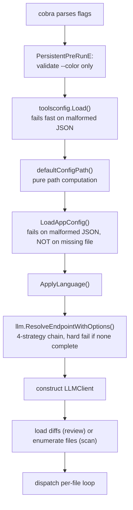

Parent document: `/CLAUDE.md`
Related documents:
- `docs/architecture/CALL_GRAPH.md`
- `docs/operations/FAILURE_MODES.md`
- `docs/ai/LLM_ARCHITECTURE.md`

Read this when:
- A run fails immediately and you need to know what "must succeed first."
- You're deciding whether a new dependency should fail fast or fail lazily.

Purpose:
- What must be healthy/resolved, and in what order, for each critical flow to start and complete.

Scope:
- Included: startup ordering for `review`/`scan`, and the external dependencies each flow needs at runtime.
- Excluded: what happens after a dependency fails (see `docs/operations/FAILURE_MODES.md`).

---

# Runtime Dependency Tree

## Startup ordering for `review` / `scan`

No eager global init beyond two `main()` calls: `llm.InitEmbeddedLoader()` (registers embedded templates/tools/rules) and `telemetry.Init(ctx)` (non-fatal on failure). Everything else is lazy, resolved inside the subcommand's `RunE`:

**No network call happens before step G succeeds.** This is deliberate — see `docs/ai/LLM_ARCHITECTURE.md` for the resolver's exact precedence.

## What must be healthy per flow

| Flow | Hard requirement | Soft/degradable requirement |
|---|---|---|
| `ocr review` | `git` binary present; complete LLM endpoint triple resolvable; repo has a valid diff for the requested mode | MCP servers (skipped individually on failure, not fatal); OTel collector (warns, non-blocking) |
| `ocr scan` | complete LLM endpoint triple resolvable; readable file tree (git-tracked or filesystem) | same as review |
| `ocr viewer` | readable `~/.opencodereview/sessions/` (missing dir = empty list, not an error) | none — no LLM/network dependency at all |
| `ocr delegate` | readable repo, resolvable rule chain | none — no LLM dependency |
| Bedrock provider specifically | AWS credential chain resolvable (profile/SSO/instance role/env) | region defaults from `AWS_REGION`/active profile if unset |
| `api_key_cmd`/`auth_token_cmd` | the configured command must exit 0 within 60s with single-line stdout ≤ 64KiB | none — hard error, no silent fallback, by design |

## Ordering rationale worth preserving

Global env overrides (`OCR_LLM_TIMEOUT`, `OCR_LLM_EXTRA_HEADERS`) are **parsed before** any resolver strategy runs but **applied after** — specifically so a malformed value fails cheaply before an `api_key_cmd` has a chance to prompt a secret manager (1Password, Touch ID) for a credential that would then be discarded. Any refactor of `resolver.go` must preserve this ordering or re-introduce spurious credential-manager prompts.

## Known gaps / uncertainties:
- Exact behavior when `toolsconfig.Load()` fails vs. `LoadAppConfig()` fails (both "fail fast," but whether the error messages distinguish the cause clearly for an end user was not verified).
