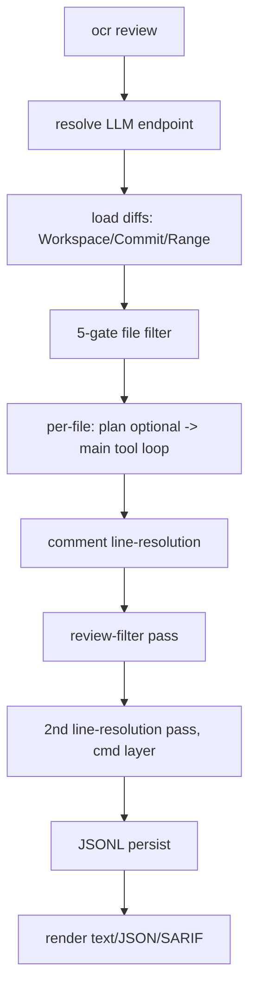
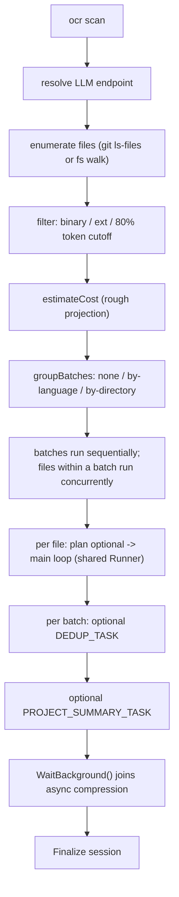

Parent document: `/CLAUDE.md`
Related documents:
- `docs/architecture/CALL_GRAPH.md`
- `docs/ai/AI_PIPELINE_MAP.md`
- `docs/ai/AGENT_WORKFLOWS.md`
- `pages/src/content/docs/en/architecture.md` (deepest existing source for the review flow — not duplicated here)

Read this when:
- You need to trace a run end-to-end for debugging or before modifying a stage.
- You are adding a new command and need to see how existing flows are structured.

Purpose:
- Step-by-step runtime flows for every top-level command, including the two (`scan`, `delegate`) not covered by the existing `architecture.md`.

Scope:
- Included: `review`, `scan`, `delegate`, `viewer`, `resume`, MCP tool-augmented flow.
- Excluded: prompt content and AI decision points in depth (`docs/ai/AI_PIPELINE_MAP.md`), retry/error classification internals (`docs/ai/LLM_ARCHITECTURE.md`).

---

# Runtime Flows

## `ocr review` (diff-scoped)

Full detail already lives in `pages/src/content/docs/en/architecture.md` — summary only:



Endpoint resolution is single-shot: config file → OCR env vars → Claude Code env vars → shell rc files, first *complete* triple wins, **no fallback across sources or providers** (`internal/llm/resolver.go`). If none resolve, the process exits non-zero before any network call.

## `ocr scan` (whole-file, no diff required)

Not covered by `architecture.md` — new flow, reuses `internal/llmloop.Runner` for the per-file loop:



Key divergences from review: batching and cross-file dedup exist only in scan (full-repo scans produce far more near-duplicate findings than a diff review); `--max-tokens-budget` is enforced per-file look-ahead right before a worker slot is acquired; scan requests are excluded from the review-only "retry report" feature (`llmloop.Deps.NewRequestMeta` left nil). See `docs/architecture/CHANGE_BLAST_RADIUS.md` for why the shared `Runner` is a high-impact hub.

## `ocr delegate` (no LLM call)

```mermaid
flowchart LR
    A["ocr delegate preview"] --> B["agent.Preview (same filter as review --preview)"]
    B --> C["print reviewable/excluded file list<br/>(Markdown or --format json, schema_version 1)"]
    D["ocr delegate rule &lt;paths&gt;"] --> E["delegate.GroupRules<br/>(4-layer resolver, no LLM)"]
    E --> F["print rule text grouped by content"]
    G[external host agent] -.reads stdout.-> C
    G -.reads stdout.-> F
    G --> H["host agent performs the actual review<br/>with its own model/tools"]
