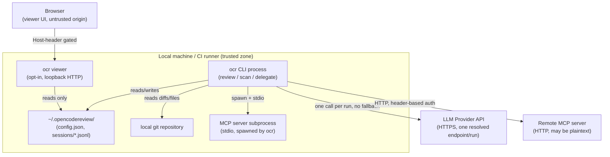

Parent document: `/CLAUDE.md`
Related documents:
- `docs/security/TRUST_BOUNDARIES.md`
- `docs/integrations/EXTERNAL_INTEGRATIONS.md`
- `docs/operations/OPERATIONAL_FAILURE_GRAPH.md`

Read this when:
- You need to understand what's actually a "service" here (mostly nothing is) before reasoning about failure/security.
- You're adding a new network-facing surface and need to see where it fits.

Purpose:
- Map every process/network boundary this system has — there is no microservice topology, but there are real trust boundaries.

Scope:
- Included: the CLI process itself, the viewer HTTP server, MCP client connections, LLM provider calls, CI-wrapper processes.
- Excluded: internal Go package structure (`DEPENDENCY_GRAPH.md`), CI-specific contracts (`docs/integrations/EXTERNAL_INTEGRATIONS.md`).

---

# Service Topology

There is no server-side deployment of this system. Every box below is either a short-lived local process or an external system OCR calls out to.

## The five boundaries

1. **CLI ↔ LLM Provider API** — HTTPS/TLS 1.2+, `InsecureSkipVerify` never set (`ASSURANCE_CASE.md` T5). Single endpoint per run; no automatic cross-provider fallback (`internal/llm/resolver.go`).
2. **CLI ↔ local MCP subprocess** — spawned with the user's full environment + configured `env`, repo-root CWD, `stdio` transport. Trust = full trust (it's a local process the user configured).
3. **CLI ↔ remote MCP server** — HTTP with header-injected auth from `$ENV_VAR` expansion. **No enforced HTTPS** for this path (unlike LLM providers) — a misconfigured URL can send credential headers over plaintext HTTP.
4. **Browser ↔ `ocr viewer`** — loopback-bound by default; Host-header allowlist (`internal/viewer/hostguard.go`) blocks DNS rebinding. No authentication — the perimeter is the Host check, not credentials, because it's designed as a local single-user tool. `OCR_VIEWER_ALLOWED_HOSTS` is required to expose a wildcard bind, and even then traffic stays plaintext HTTP (no TLS).
5. **CLI ↔ local filesystem/git** — `pathutil.WithinBase()` constrains all agent-tool file access to the repo root; `git` is invoked with hardcoded subcommands, never through a shell (`ASSURANCE_CASE.md` T1, T3).

## What's structurally different from the rest

**`ocr delegate` + QCA Forward** is a sixth, non-network boundary worth naming explicitly: an external host agent (not OCR) becomes the reviewer. OCR's role shrinks to deterministic file-selection and rule text — no LLM endpoint, no API key, nothing configured. The QCA Forward integration's own documentation acknowledges its Bash-readonly constraint is **prompt-enforced only, not sandboxed by OCR** — a genuine trust gap, not a design oversight OCR is unaware of. See `docs/security/TRUST_BOUNDARIES.md`.

## Known gaps / uncertainties:
- Whether any built-in provider preset's base URL could resolve to plaintext HTTP was not exhaustively checked (all 26 presets use `https://` — spot-checked, not every entry individually re-verified in this pass).
- Remote MCP server TLS enforcement (or lack thereof) was inferred from the transport code path, not from an explicit HTTPS-only check being absent — flagged for a direct confirming read if this becomes security-relevant.
