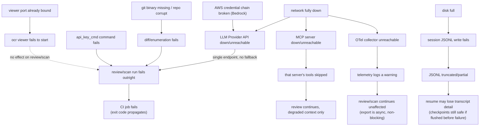

Parent document: `/CLAUDE.md`
Related documents:
- `docs/operations/FAILURE_MODES.md`
- `docs/architecture/SERVICE_TOPOLOGY.md`
- `docs/architecture/RUNTIME_DEPENDENCY_TREE.md`

Read this when:
- You need to reason about what else breaks when one dependency goes down.

Purpose:
- Failure-propagation graph across the system's external dependencies.

Scope:
- Included: LLM provider, MCP server, git, disk, network, OTel collector.
- Excluded: individual scenario detail (see `FAILURE_MODES.md` — this doc is the propagation shape, not the symptom table).

---

# Operational Failure Graph

## Key propagation properties

- **LLM provider failure is a hard stop, not a degraded mode** — there is no cross-provider fallback (`docs/ai/LLM_ARCHITECTURE.md`), so this is the single highest-impact external dependency in the system.
- **MCP failure is isolated by design** — a down MCP server degrades context quality for the model, it does not fail the run. This is the one dependency that fails soft.
- **Telemetry failure never propagates to the review/scan outcome** — by design (async export, non-blocking, warn-and-continue).
- **Disk failure has a partial-blast-radius by design** — the force-flush-on-checkpoint-write pattern in `internal/session/persist.go` means a mid-run disk failure loses *debugging* detail before it loses *resume correctness*, because checkpoints are prioritized.
- **The viewer is fully isolated from review/scan** — it has no LLM/network dependency at all and its failure (port conflict) cannot affect an in-progress or future review/scan.

## Known gaps / uncertainties:
- Behavior when disk fills up *during* a force-flush write to a checkpoint record (not just the buffered records) — whether that specific write failure is handled gracefully or can corrupt the JSONL file — was not confirmed.
