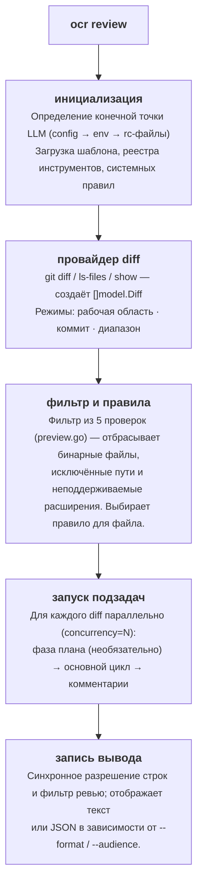
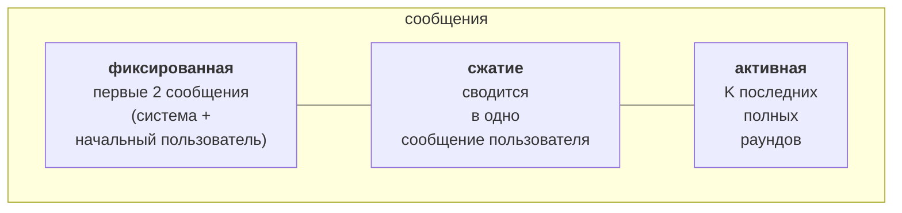

Обзор того, как `ocr review` работает внутри: от нажатия Enter до JSON в терминале. Его цель — дать достаточно ясную модель, чтобы отлаживать поведение, настраивать флаги и уверенно читать исходный код.

## Конвейер верхнего уровня



Оркестрация расположена в пакете [`internal/agent/`](https://github.com/alibaba/open-code-review/blob/main/internal/agent/), который включает четыре файла: `agent.go` (основной цикл и запуск задач), `compression.go` (сжатие памяти), `preview.go` (фильтр файлов) и `util.go` (вспомогательные функции). Важны две точки входа: `Agent.Run` (начало конвейера) и `Agent.dispatchSubtasks` (распараллеливание по файлам).

## Провайдер diff

`internal/diff/git.go` определяет структуру `Provider`, чьё неэкспортируемое поле `mode` (типа `Mode`, перечисление `int`) выбирает один из трёх режимов, соответствующих флагам CLI:

| Режим | Активируется | Возвращает |
|---|---|---|
| `Workspace` | без флагов | проиндексированные + непроиндексированные + неотслеживаемые изменения |
| `Commit` | `--commit <sha>` / `-c <sha>` | изменения, внесённые `<sha>` (через `git show <sha>`, эквивалент diff `<sha>^..<sha>`) |
| `Range` | `--from <a> --to <b>` | `merge-base(a, b)..b` |

Каждый diff содержит: старый/новый путь, старые/новые ханки, количество добавлений/удалений, флаг бинарного файла и определение переименований. `DiffContextLines` фиксирован и равен **3** — тому же значению Git по умолчанию.

Неотслеживаемые файлы читаются с диска и рассматриваются как добавления целого файла, поэтому они попадают в ревью до коммита.

## Фильтр файлов из пяти проверок

После загрузки diff каждый файл проходит через [`whyExcluded`](https://github.com/alibaba/open-code-review/blob/main/internal/agent/preview.go). Функция возвращает одно из:

```
binary          — файл бинарный
user_exclude    — совпал с шаблоном в вашем списке `exclude`
unsupported_ext — расширения нет в supported_file_types.json
default_path    — совпал со встроенным шаблоном исключения тестовых файлов
```

…либо пустую строку, если файл сохранён. `deleted` **не** возвращается `whyExcluded`: он вычисляется позже в `Preview()`, когда diff сохранённого файла сообщает `IsDeleted`. Проверки выполняются в следующем порядке:

1. `binary` — бинарные файлы отбрасываются первыми.
2. `user_exclude` — `exclude` вашего проекта всегда имеет приоритет.
3. `user_include` — если фильтр содержит шаблоны include **и** файл совпадает с одним из них, он сразу сохраняется (возвращается пустая строка), обходя проверки `unsupported_ext` и `default_path` ниже.
4. `unsupported_ext` фильтрует по разрешённому списку расширений.
5. `default_path` — последняя проверка: совпадение со встроенными шаблонами исключения **тестовых файлов** (`**/*_test.go`, `**/*.test.{js,jsx,ts,tsx}`, `**/__tests__/**`, `**/*_test.py`, `**/*_spec.rb`, `**/*.test.ets`, …). Каждый шаблон имеет префикс `**/`.

Фильтрация шумных каталогов (`vendor/`, `node_modules/`, `target/`, …) выполняется раньше, на уровне провайдера diff, через список `providerDirIgnoreDirs` в `internal/diff/git.go`: diff этих каталогов разбираются, а затем удаляются `filterDiffs`, прежде чем достигнут фильтра по файлам.

Запустите `ocr review --preview`, чтобы увидеть полный результат фильтра без расхода токенов. Полный алгоритм описан в [Правилах ревью](../review-rules/#how-files-are-filtered).

## Подзадача по файлу: план + основной цикл

Для каждого файла, прошедшего фильтрацию, OCR запускает подагента. Каждый подагент работает в собственной горутине, ограниченной `--concurrency` (по умолчанию **8**), и имеет собственный буфер сообщений LLM.

Подзадача содержит до **двух фаз**:

### Фаза 1 — План (необязательно)

```go
threshold := template.PlanModeLineThreshold     // 50
changeLines := d.Insertions + d.Deletions
if changeLines < threshold { skip plan }
```

Для небольших diff план добавляет задержку без пользы, поэтому он молча пропускается, и сразу запускается основной цикл. Для крупных diff OCR выполняет **один** вызов LLM `PLAN_TASK`: поле `Tools` не отправляется, поэтому модель не может вызывать инструменты при планировании. Подмножество инструментов только для чтения (`code_search`, `file_read_diff`, `file_find` — три инструмента, у которых флаг `plan_task` в `tools.json` равен `true`) встраивается как обычный текст через заполнитель `{{plan_tools}}` (его формирует `formatToolDefs`), чтобы модель знала, что будет доступно позднее. Модель возвращает контрольный список, который становится `{{plan_guidance}}` в основной подсказке.

### Фаза 2 — Основной цикл

Основной цикл собирает подсказку `MAIN_TASK` и запускает с моделью диалог с использованием инструментов. Полный набор добавляет **`task_done`**, **`code_comment`** и **`file_read`** к инструментам фазы плана — полный каталог см. в разделе [Инструменты](../tools/).

```
цикл до MAX_TOOL_REQUEST_TIMES (по умолчанию 30):
    response = llm.complete(messages, tools)
    если response.toolCalls пуст:
        напомнить модели: "Не удалось успешно вызвать инструменты.
                          Повторите попытку или используйте task_done по завершении."
        продолжить
    для каждого вызова: выполнить → собрать результат
    если какой-либо вызов — task_done: выйти
    addNextMessage(...)              # может запустить сжатие
```

Цикл имеет пять условий выхода:

1. Вызван `task_done`.
2. Исчерпан `MAX_TOOL_REQUEST_TIMES`.
3. Три последовательных раунда не дали корректных результатов инструментов (`maxConsecutiveEmptyRounds = 3`).
4. Контекст отменён.
5. `addNextMessage` вернул `false` — сжатие не смогло уменьшить буфер сообщений ниже порога предупреждения.

Во всех случаях собранные вызовы `code_comment` становятся комментариями ревью.

## Сжатие памяти

Длинный цикл вызова инструментов в итоге переполнит контекстное окно. OCR управляет этим с помощью **стратегии разделения на три зоны**, срабатывающей по бюджету токенов `MAX_TOKENS = 58888`:

| Порог | Константа | Действие |
|---|---|---|
| 60 % MAX_TOKENS | `tokenSoftThreshold` | Запускает **асинхронное** фоновое сжатие; текущий цикл продолжается без остановки. |
| 80 % MAX_TOKENS | `tokenWarningThreshold` | Выполняет сжатие **синхронно** до отправки следующего запроса. |

### Три зоны



«Раунд» — это одно сообщение ассистента и следующие за ним сообщения с результатами инструментов. `partitionMessages` проходит раунды с конца, сохраняя столько, сколько помещается в `(0.80 × MAX_TOKENS) - reservedTokens`. Всё более старое становится **зоной сжатия**.

Зона сжатия отображается как XML и передаётся модели с подсказкой `MEMORY_COMPRESSION_TASK`; возвращённая сводка добавляется к исходному сообщению пользователя внутри тегов `<previous_review_summary>`.

```go
// compression.go
func (a *Agent) runCompression(ctx context.Context, msgs []llm.Message, filePath string) ([]llm.Message, error) {
    part := partitionMessages(msgs, a.args.Template.MaxTokens, 0)
    contextXML := buildMessageXML(msgs[part.frozenEnd:part.compressEnd])
    // … call MEMORY_COMPRESSION_TASK …
    rebuilt[1] = llm.NewTextMessage(role, currentText+
        "\n\n<previous_review_summary>\n"+rawSummary+"\n</previous_review_summary>")
    for i := part.compressEnd; i < len(msgs); i++ {
        rebuilt = append(rebuilt, msgs[i])
    }
    return rebuilt, nil
}
```

### Асинхронный и синхронный режимы

Асинхронный путь позволяет основному циклу продолжать вызывать инструменты, пока сжатие выполняется в фоне; при следующей проверке токенов готовая сводка подставляется через `tryApplyPendingCompression`. Если соотношение пересекает порог предупреждения до завершения асинхронной задачи, цикл останавливается и синхронно запускает `runCompression`, гарантируя, что следующий запрос всегда поместится.

## Конвейер обработки комментариев

Каждый вызов инструмента `code_comment` создаёт один или несколько исходных комментариев. Они проходят через **CommentWorkerPool** (пул горутин фиксированного размера), поэтому основной цикл вызовов инструментов никогда не блокируется постобработкой:

1. **Разрешение строк** (в воркере) — `existing_code` сопоставляется с diff алгоритмом скользящего окна для вычисления точных `start_line` / `end_line`. Если сопоставление не удалось, оба значения становятся `0`: диапазон строк `0` — неявный сигнал «непривязанного» комментария, который пользователь должен найти вручную (сохранённого флага нет; последующие потребители проверяют `start_line == 0`).
2. **Задача повторного размещения** *(необязательный резервный вариант)* — если разрешение строки не удалось на нетривиальном diff, OCR запускает подсказку `RE_LOCATION_TASK`, запрашивая у модели повторную привязку фрагмента. Полезно для перефразированных строк `existing_code`.
3. **Фильтр ревью** — после завершения основного цикла (и освобождения пула воркеров) вызов LLM `REVIEW_FILTER_TASK` проверяет собранные комментарии относительно diff и удаляет доказуемо неверные. Ошибки здесь записываются в журнал и игнорируются.
4. **Второй проход разрешения строк** — когда `Agent.Run` возвращает управление, команда верхнего уровня повторно запускает `diff.ResolveLineNumbers` по полному набору комментариев (см. `cmd/opencodereview/review_cmd.go`), чтобы обработать комментарии, у которых `existing_code` охватывает несколько файлов или был обновлён шагом повторного размещения.
5. **Отображение** — в текст или JSON в зависимости от `--format`.

## Ограничители бюджета токенов

До первого вызова LLM OCR выполняет быструю проверку:

```go
tokenLimit := MaxTokens * 4 / 5     // 80 %
if countMessagesTokens(messages) > tokenLimit {
    record warning "token_threshold_exceeded"
    return nil      // skip this file
}
```

Она обрабатывает огромные diff (автоматически созданные lock-файлы, рефакторинги тысяч строк), прежде чем они потребуют запроса. Пропущенный файл выводится как некритическое предупреждение в stdout и добавляется в массив JSON `warnings`.

Вторая проверка выполняется в `filterLargeDiffs`: если один diff превышает 80 % `MAX_TOKENS`, он отфильтровывается до запуска диспетчера задач по файлам.

## Шаблон и заполнители

`internal/config/template/task_template.json` содержит **пять подсказок**:

| Ключ | Назначение |
|---|---|
| `PLAN_TASK` | Фаза планирования — создаёт контрольный список. |
| `MAIN_TASK` | Основной цикл ревью — создаёт вызовы `code_comment`. |
| `MEMORY_COMPRESSION_TASK` | Суммирует зону сжатия. |
| `REVIEW_FILTER_TASK` | Проход после цикла, удаляющий доказуемо неверные комментарии. |
| `RE_LOCATION_TASK` | Повторно привязывает комментарий, чей `existing_code` не удалось сопоставить. |

Каждая подсказка — список ссылок `{role, prompt_file}` на `.md`-файлы в каталоге шаблона (например, `{"role": "system", "prompt_file": "main_task_system.md"}`). При загрузке `resolveConversation` читает эти файлы в сообщения `{role, content}` в памяти, затем заполнители шаблона разрешаются для каждого файла:

| Заполнитель | Заменяется на |
|---|---|
| `{{system_rule}}` | Тело правила, разрешённое из цепочки четырёх уровней. |
| `{{change_files}}` | Статус и путь каждого другого изменённого файла в PR. |
| `{{diff}}` | Diff этого файла (необработанный вывод `git diff`). |
| `{{current_file_path}}` | Новый путь этого файла. |
| `{{plan_guidance}}` | Вывод фазы плана либо удаляется при пропуске плана. |
| `{{plan_tools}}` | Определения инструментов фазы плана в виде обычного текста (созданного `formatToolDefs`); используется в системной подсказке `PLAN_TASK`. |
| `{{requirement_background}}` | Содержимое флага `--background`. |
| `{{current_system_date_time}}` | Локальное время запуска в формате `YYYY-MM-DD HH:MM` (без секунд и часового пояса). |
| `{{context}}` | (только сжатие) сообщения, отображённые как XML для суммирования. |
| `{{path}}` | Путь файла, используется в `REVIEW_FILTER_TASK`. |
| `{{comments}}` | Накопленные комментарии (JSON), используются в `REVIEW_FILTER_TASK`. |

Подстановка заполнителей находится в [`agent.go`](https://github.com/alibaba/open-code-review/blob/main/internal/agent/agent.go). Сам шаблон не переопределяется через CLI: чтобы изменить подсказки, отредактируйте [`task_template.json`](https://github.com/alibaba/open-code-review/blob/main/internal/config/template/task_template.json) и пересоберите программу. Флаг `--tools` переопределяет *реестр инструментов* (заменяет JSON, используемый `internal/config/toolsconfig`), а не шаблон — см. [Инструменты](../tools/#customizing-tools).

> **Особенность синтаксиса заполнителей.** Все заполнители выше используют синтаксис двойных скобок `{{…}}`, *кроме* `RE_LOCATION_TASK`, который подставляет одинарные скобки `{diff}`, `{existing_code}` и `{suggestion_content}` (см. `internal/diff/relocation.go`).

## Хранение данных

Каждое ревью записывается на диск в формате JSONL:

```
~/.opencodereview/sessions/<encoded-repo-path>/<session-id>.jsonl
```

Путь репозитория **не** кодируется в base64: `encodeRepoPath` (в `internal/session/persist.go`) заменяет `/` и `\` на `-`, а `:` на `_`, чтобы путь был безопасен для файловой системы.

Каждая строка — одно событие: отправка подсказки, ответ LLM, вызов инструмента, результат инструмента, созданный комментарий и т. д. Веб-интерфейс (`ocr viewer`) читает эти файлы напрямую — базы данных нет, только журналы с добавлением записей. Обзор UI и схему событий см. в разделе [Просмотр сессий](../viewer/).

## Телеметрия

Когда телеметрия включена, агент создаёт три span уровня конвейера (`review.run` для всей задачи, `diff.parse` для загрузки diff и один `subtask.execute.<file>` для каждого проверенного файла), а также краткоживущий span `event.<name>` в каждой точке принятия решения (`plan.skipped`, `token.threshold.exceeded`, `subtask.error`, …). Раунды LLM и вызовы инструментов записываются только как метрики, не как span. Содержимое подсказок и ответов **никогда** не добавляется в телеметрию; флаг `OCR_CONTENT_LOGGING` передаётся в коде, но пока не используется. Полная схема приведена в разделе [Телеметрия](../telemetry/).

## Что *не* автоматизировано

Некоторые решения намеренно остаются ручными:

- **Определение конечной точки не имеет резервного варианта.** Если ваши config + env + rc-файлы не дают полный набор `(URL, token, model)`, OCR завершается с ненулевым кодом вместо угадывания.
- **Сбои подагентов изолированы и не повторяются.** Сбой одного файла создаёт предупреждение, остальные продолжают работу. Повторные попытки должны быть в обёртывающем конвейере CI, а не в агенте.
- **Нет межфайлового анализа.** Каждый файл проверяется в собственной беседе LLM. Межфайловые вопросы проходят через вызовы инструментов `file_read_diff` / `code_search`, а не через общий контекст. Замечания в этих *других* файлах также нельзя использовать как цели комментариев: подсказка `main_task` предписывает модели применять контекстные инструменты только для понимания и игнорировать проблемы, найденные вне текущего diff.

Эти решения делают запуск **детерминированным для каждого файла** и сохраняют предсказуемую стоимость.

## Карта исходного кода

Если хотите читать исходный код параллельно:

| Область | Файл |
|---|---|
| Диспетчеризация команд верхнего уровня | `cmd/opencodereview/main.go` |
| Разбор флагов `review` | `cmd/opencodereview/flags.go` |
| Оркестрация агентов и сжатие | `internal/agent/` (agent.go, compression.go, util.go) |
| Фильтр файлов / предпросмотр | `internal/agent/preview.go` |
| Загрузка diff (режимы Git) | `internal/diff/git.go` |
| Цепочка разрешения правил | `internal/config/rules/system_rules.go` |
| Реестр и реализации инструментов | `internal/tool/` |
| Разрешение конечной точки LLM | `internal/llm/resolver.go` |
| Средство записи JSONL сессии | `internal/session/persist.go` |
| Веб-просмотрщик | `internal/viewer/server.go` |

Инструкции по сборке и тестированию см. в разделе [Участие в разработке](../contributing/).

## См. также

- [Инструменты](../tools/) — шесть инструментов, которые вызывает цикл агента.
- [Правила ревью](../review-rules/) — как разрешается текст правила для файла.
- [Просмотр сессий](../viewer/) — просмотр расшифровок, записываемых этим конвейером.
